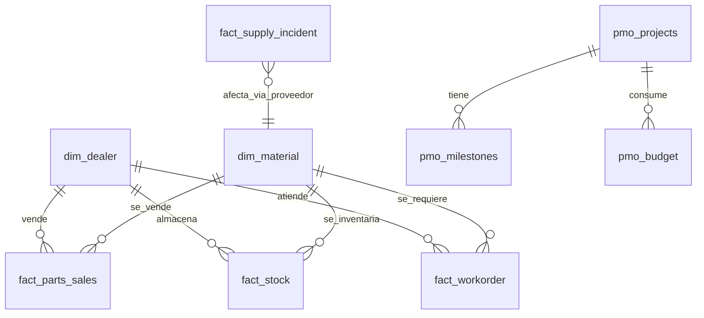

# La historia: Inchcape Andina, posventa y repuestos

Los datos de este taller no son ruido aleatorio. Cuentan un caso que se puede
investigar, cuantificar y resolver. Si al final del ejercicio pudiste explicar
qué pasó, a quién le pegó y cuánto costó, el taller funcionó.

## El negocio

Inchcape Andina distribuye vehículos y repuestos en Colombia, Perú y Chile.
La red son 120 puntos: concesionarios, talleres autorizados y puntos de repuestos.

El dinero de posventa entra por dos vías. Una es la venta de repuestos sobre el
mostrador. La otra, más rentable, es la hora de bahía: cuando un vehículo entra
al taller, la bahía factura mano de obra. Una bahía parada no factura nada, y la
hora perdida no se recupera después.

## Qué pasó

Entre el **2 de marzo y el 17 de abril de 2026** se juntaron dos cosas.

**Primero, un proveedor se cayó.** Nippon Parts, que abastece 100 de los 800
repuestos del maestro, suspendió embarques seis semanas por un paro en su planta.
Es el proveedor con el lead time más largo de todos, así que no había colchón.

**Segundo, y esto es lo que nadie vio venir: el maestro de materiales estaba
sucio.** Doce repuestos estaban cargados dos veces, con códigos distintos y la
misma descripción. El cálculo del punto de reorden usó solo una de las dos
entradas de cada par, así que la señal de demanda quedó partida a la mitad y el
pedido de reabastecimiento se disparó tarde.

Un retraso de proveedor se sobrevive con inventario. Un retraso de proveedor
sobre un maestro sucio, no.

## Lo que se ve en los datos

- La venta de repuestos de Nippon Parts pasa de cerca de **1.8 millones de
  dólares mensuales a 385 mil en marzo**, y recupera en mayo.
- Los quiebres de stock suben de un **4% de las combinaciones punto por repuesto
  a un 10.5%** en marzo.
- Las órdenes de taller que se quedan esperando repuesto pasan de un promedio de
  **1.6 horas de espera a 6.9 horas**.
- El cumplimiento de SLA cae del 100% al 93.6%.
- El impacto en plata, valorizando las horas de bahía detenidas a la tarifa de
  cada punto, es de **998 mil dólares en las seis semanas del incidente**, sobre
  un total de 2.56 millones en los doce meses.

## Y la PMO, en el medio

La PMO abrió un portafolio de 25 proyectos para arreglar esto, el programa
"Plan Posventa 360". El portafolio tiene los problemas de siempre, y son los que
vas a cazar en el ejercicio:

- **3 proyectos están cargados dos veces** con nombre idéntico y código distinto,
  así que el presupuesto total del portafolio está inflado.
- **2 proyectos no tienen fecha de cierre comprometida**, entonces no se puede
  decir si van tarde.
- **11 de los 25 ya gastaron más de lo aprobado.**

Este es exactamente el cruce que hoy se hace a mano en Excel antes de cada
reporte oficial, y es lo que vamos a automatizar.

## El mapa de datos

Catálogo `inchcape_workshop`, tres esquemas.

**`ops`, la operación de posventa**

- `dim_dealer`, 120 filas. La red. Ojo con `bahias` y `tarifa_hora_usd`: con esas
  dos columnas se valoriza el tiempo perdido.
- `dim_material`, 800 filas. El maestro de repuestos, con los duplicados adentro.
- `fact_parts_sales`, unas 175 mil filas. La venta, doce meses.
- `fact_stock`, 499 mil filas. Foto semanal de inventario de los 80 repuestos de
  mayor rotación. Acá viven los quiebres.
- `fact_workorder`, 60 mil filas. Las órdenes de taller. La columna
  `costo_espera_usd` es el impacto en dólares.
- `fact_supply_incident`, 40 filas. Los eventos de abastecimiento. `INC-0001` e
  `INC-0002` son la causa raíz.

**`pmo`, el portafolio**

- `pmo_projects`, 25 filas. Los proyectos, con presupuesto y fechas.
- `pmo_milestones`, 150 filas. Seis hitos por proyecto. La brecha entre
  `fecha_plan` y `fecha_real` es el deslizamiento.
- `pmo_budget`, 300 filas. Presupuesto contra ejecutado, mes por mes.

**`raw`, los extractos crudos de SAP**

- `raw.sap_mara`, 830 filas. El maestro tal como sale de SAP: fechas como texto
  en formato AAAAMMDD, códigos con dieciocho posiciones y ceros a la izquierda,
  espacios sobrantes, decimales con coma y treinta registros repetidos.
- `raw.sap_vbap`, unas 44 mil filas. Posiciones de documento de venta, igual de
  sucias, con materiales vacíos y algunos valores en negativo.

## Las preguntas que hay que poder responder

1. ¿En qué mes se rompió la operación, y cómo se ve la anomalía?
2. ¿Qué proveedor y qué familias de repuestos están detrás?
3. ¿Cuánta plata se perdió, y en qué puntos de la red se concentró?
4. ¿Por qué el reabastecimiento no se disparó a tiempo?
5. ¿Cuál es el presupuesto real del portafolio, una vez que quitás los proyectos
   duplicados?
6. ¿Qué proyectos hay que escalar hoy, y con qué evidencia?
